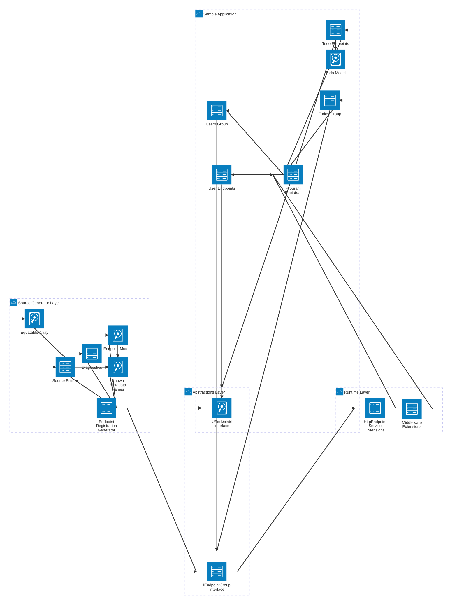

# RA.Utilities.Api.Sample

A minimal API sample demonstrating compile-time endpoint registration with
`RA.Utilities.Api`.

## Run

```bash
dotnet run --project Api/RA.Utilities.Api.Sample/RA.Utilities.Api.Sample.csproj
```

Try the routes:

| Method | Route            | Description        |
| ------ | ---------------- | ------------------ |
| GET    | `/api/todos`     | List all todos     |
| POST   | `/api/todos`     | Create a todo      |
| GET    | `/api/users`     | List all users     |
| GET    | `/api/users/{id:int}` | Get a user by id |
| GET    | `/scalar/v1`     | Interactive API reference (Scalar UI) |



## How it works

The whole `Program.cs` is:

```csharp
var builder = WebApplication.CreateBuilder(args);
var app = builder.Build();
app.MapEndpoints();
app.Run();
```

Everything else is discovered at **compile time** by the
`RA.Utilities.Api.Generators` source generator (shipped inside the `RA.Utilities.Api`
NuGet package):

* `Endpoints/TodosGroup.cs` and `Endpoints/UsersGroup.cs` implement `IEndpointGroup`
  and build the shared `RouteGroupBuilder` (prefix + tags) for their feature.
* `Endpoints/GetTodosEndpoint.cs`, `Endpoints/CreateTodoEndpoint.cs`,
  `Endpoints/GetUsersEndpoint.cs`, and `Endpoints/GetUserByIdEndpoint.cs` implement
  `IEndpoint` and map their routes into the group identified by their `GroupName`.

The generator validates the group names at compile time: a duplicate `GroupName`
(`EPMG001`) or an endpoint referencing a missing group (`EPMG002`) is a build error,
not a runtime surprise.
