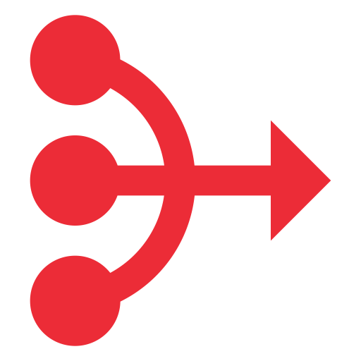

<p align="center">
  
</p>

# RA.Utilities.Feature

[](https://www.nuget.org/packages/RA.Utilities.Feature/)

`RA.Utilities.Feature` provides a foundational toolkit for implementing the **Vertical Slice Architecture** pattern using CQRS (Command Query Responsibility Segregation). It offers base handlers, validation behaviors, and exception handling mechanisms to streamline feature development and promote clean, maintainable code.

This package is designed to work like a mediator library to create self-contained "features" or "slices," where all the logic for a single use case—from request to response—is located together.

## Purpose

Building applications with a traditional layered architecture can lead to wide, coupled classes and scattered logic.
The Vertical Slice pattern, combined with CQRS, addresses this by organizing code around features.
This package provides the essential building blocks to support that pattern:

1.  **Consistent Handler Logic**: It offers generic base handlers that encapsulate common logic like logging, exception handling, and performance monitoring. This reduces boilerplate and ensures every feature behaves consistently.
2.  **Automatic Validation**: It includes a pipeline behavior that automatically validates incoming CQRS requests (commands/queries) using `FluentValidation`, returning a structured error response on failure.
3.  **Robust Error Handling**: It integrates seamlessly with the `Result` type from `RA.Utilities.Core`, allowing handlers to return explicit success or failure outcomes without relying on exceptions for control flow.

By using `RA.Utilities.Feature`, you can build features faster, with more confidence, and with less repetitive code.

## 🛠️ Installation

You will need to install this package along with a mediator implementation (like MediatR) and FluentValidation.

```sh
dotnet add package RA.Utilities.Feature
dotnet add package FluentValidation.DependencyInjectionExtensions
```

---

## ✨ Features

### 1. Base Handlers

The package provides abstract base classes that implement the `IRequestHandler` interfaces. Inheriting from these base classes gives your handlers a consistent structure and automatically handles cross-cutting concerns.

The primary base classes are:
-   **`RequestHandler<TRequest>`**: For handlers that process a request but do not return a value. It implements `IRequestHandler<TRequest>`.
-   **`RequestHandler<TRequest, TResponse>`**: The most common handler, for requests that return a value. It implements `IRequestHandler<TRequest, TResponse>` and is designed to work with the `Result<T>` type from `RA.Utilities.Core`.

These base classes include built-in logging for the start and end of a request, automatic exception catching (which wraps exceptions in a `Result.Failure`), and a clear `HandleAsync` method for you to override with your business logic.

### 2. Validation Pipeline Behavior

The `ValidationBehavior<TRequest, TResponse>` is a MediatR pipeline behavior that intercepts incoming requests, finds the corresponding `FluentValidation` validator, and executes it.

-   If validation passes, the request proceeds to the handler.
-   If validation fails, the pipeline is short-circuited, and a `Result.Failure` containing a `ValidationException` is returned immediately. This prevents invalid data from ever reaching your business logic.

---

## 🚀 Usage Example

Let's walk through creating a complete feature slice for creating a new product.

### Step 1: Define the Command and Validator

First, define the command (the request) and its validation rules.

```csharp
// Features/Products/CreateProduct.cs

using FluentValidation;
using RA.Utilities.Core;

// The command containing the data for the new product
public record CreateProductCommand(string Name, decimal Price) : IRequest<Result<int>>;

// The validator for the command
public class CreateProductCommandValidator : AbstractValidator<CreateProductCommand>
{
    public CreateProductCommandValidator()
    {
        RuleFor(x => x.Name).NotEmpty().MaximumLength(100);
        RuleFor(x => x.Price).GreaterThan(0);
    }
}
```

### Step 2: Implement the Handler

Next, create the handler by inheriting from `IRequestHandler<TRequest, TResponse>`. This is where your business logic lives.

```csharp
// Features/Products/CreateProduct.cs (continued)

using RA.Utilities.Feature.Abstractions;
using Microsoft.Extensions.Logging;
using RA.Utilities.Core;

public class CreateProductHandler : RequestHandler<CreateProductCommand, Result<int>>
{
    private readonly IProductRepository _productRepository;
 
    // Inject dependencies and the base logger
    public CreateProductHandler(IProductRepository productRepository, ILogger<CreateProductHandler> logger)
        : base(logger)
    {
        _productRepository = productRepository;
    }

    // Override the base HandleAsync to implement the core business logic
    public override async Task<Result<int>> HandleAsync(CreateProductCommand command, CancellationToken cancellationToken)
    {
        // Check if a product with the same name already exists
        if (await _productRepository.DoesProductExistAsync(command.Name))
        {
            // Return a failure Result using a custom exception
            return new ConflictException(nameof(Product), command.Name);
        }

        var newProduct = new Product { Name = command.Name, Price = command.Price };
        
        var productId = await _productRepository.AddAsync(newProduct);

        // Return a success Result with the new product's ID
        return productId;
    }
}
```

### Step 3: Register Services in `Program.cs`

Finally, wire up MediatR, the validation behavior, and your validators in your application's service configuration.

```csharp
// Program.cs
using RA.Utilities.Feature.Behaviors;

var builder = WebApplication.CreateBuilder(args);

_ = services.AddCustomMediator();

 _ = services
      .AddFeature<CreateProductCommand, CreateProductHandler>()
      .AddDecoration<LoggingBehavior<CreateProductCommand>>()
      .AddValidator<CreateProductCommandValidator>();

var app = builder.Build();

// ... your endpoint mapping

app.Run();
```

With this setup, when your API endpoint sends a `CreateProductCommand`, it will be automatically validated. If valid, the `CreateProductHandler` will execute within a managed scope that provides logging and exception safety.

## Contributing

Contributions are welcome! If you have a suggestion or find a bug, please open an issue to discuss it.

### Pull Request Process

1.  **Fork the Repository**: Start by forking the RA.Utilities repository.
2.  **Create a Branch**: Create a new branch for your feature or bug fix from the `main` branch.
3.  **Make Your Changes**: Write your code, ensuring it adheres to the existing coding style. Add or update XML documentation for any new public APIs.
4.  **Update README**: If you are adding new functionality, please update the `README.md` file accordingly.
5.  **Submit a Pull Request**: Push your branch to your fork and open a pull request to the `main` branch of the original repository. Provide a clear description of the changes you have made.

### Coding Standards

-   Follow the existing coding style and conventions used in the project.
-   Ensure all public members are documented with clear XML comments.
-   Keep changes focused. A pull request should address a single feature or bug.

Thank you for contributing!