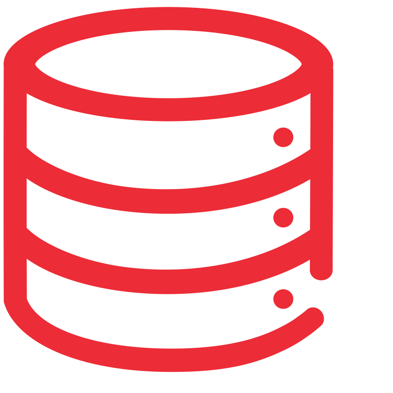

<p align="center">
  
</p>

# RA.Utilities.Data.Abstractions

[](https://www.nuget.org/packages/RA.Utilities.Data.Abstractions/)

Provides a collection of essential data access abstractions, including the Repository and Unit of Work patterns. This library helps create a decoupled and testable data access layer in .NET applications.

## 🎯 Purpose

The goal of this library is to provide a clean, reusable, and consistent way to interact with a data source. By abstracting data access logic behind generic interfaces, you can:

- **Decouple Your Layers**: Your business logic depends on abstractions (`IRepository<T>`) rather than concrete data access technologies (like Entity Framework Core).
- **Improve Testability**: Easily mock repositories and units of work in your unit tests.
- **Enforce Consistency**: Ensure that data access patterns are used consistently across your application.

This package is a core component of the `RA.Utilities` ecosystem and is designed to be used with `RA.Utilities.Data.Entities`.

## ✨ Features

- **Repository Pattern**: Generic interfaces for CRUD (Create, Read, Update, Delete) operations.
- **Segregated Interfaces**: Separate read (`IReadRepositoryBase<T>`) and write (`IWriteRepositoryBase<T>`) interfaces to enforce CQS (Command Query Separation).
- **Unit of Work**: A `SaveChangesAsync` method to commit transactional changes, ensuring data consistency.
- **IDbContext**: An interface for the DbContext
- **Async Support**: All data operations are asynchronous, promoting scalable and responsive applications.
- **Decoupling**: Enforces a clean separation between your domain/application layers and the data access/infrastructure layer.

## 🛠️ Installation

Install the package via the .NET CLI:

```bash
dotnet add package RA.Utilities.Data.Abstractions
```

Or through the NuGet Package Manager console:

```powershell
Install-Package RA.Utilities.Data.Abstractions
```

---

## Core Components

### `IRepository<TEntity>`

A generic interface that defines standard CRUD (Create, Read, Update, Delete) operations for an entity.

**Key Methods:**
- `GetByIdAsync`: Retrieves an entity by its primary key.
- `GetAllAsync`: Retrieves all entities of a given type.
- `FindAsync`: Finds entities based on a predicate.
- `AddAsync`: Adds a new entity.
- `Update`: Updates an existing entity.
- `Remove`: Deletes an entity.

### `IUnitOfWork`

Represents a transaction that groups multiple repository operations. It ensures that all changes are either committed together or rolled back in case of an error.

**Key Responsibilities:**
- Exposes `IRepository<T>` instances for each entity.
- Provides a `SaveChangesAsync` method to commit all changes to the underlying data store.


## 🚀 Usage Guide

This guide demonstrates how to use the abstractions in your application/service layer. The focus is on depending on the interfaces, not on their implementation.

### 1. Define Your Entities

First, define your domain entities. It's recommended to use `BaseEntity` from the `RA.Utilities.Data.Entities` package to ensure compatibility with base repository implementations.

```csharp
using RA.Utilities.Data.Entities;

public class Product : BaseEntity
{
    public string Name { get; set; }
    public decimal Price { get; set; }
}
```

### 2. Define a Repository Interface

Create a specific repository interface for your entity that inherits from `IRepositoryBase<T>`.

```csharp
using RA.Utilities.Data.Abstractions;

public interface IProductRepository : IRepositoryBase<Product>
{
    // You can add custom, entity-specific query methods here
    Task<IEnumerable<Product>> GetProductsInPriceRangeAsync(decimal min, decimal max, CancellationToken cancellationToken = default);
}
```

### 3. Implement the Repository

Next, create a concrete implementation of your repository. This is typically done in the **Infrastructure** or **Data Access** layer of your application. The key here is to depend on the `IDbContext` abstraction rather than a concrete `DbContext` class.

First, ensure your `DbContext` implements `IDbContext`.

```csharp
using RA.Utilities.Data.Abstractions;
using Microsoft.EntityFrameworkCore;

public class ApplicationDbContext : DbContext, IDbContext
{
    public ApplicationDbContext(DbContextOptions<ApplicationDbContext> options) : base(options) { }

    public DbSet<Product> Products { get; set; }
    // Other DbSets...
}
```

Now, implement the repository by injecting `IDbContext`.

```csharp
// This implementation uses the base repository from RA.Utilities.Data.EntityFramework.
public class ProductRepository : RepositoryBase<Product>, IProductRepository
{
    public ProductRepository(IDbContext dbContext) : base(dbContext as DbContext)
    {
        // The base RepositoryBase<T> from the EF package expects a concrete DbContext,
        // so a cast is necessary. This still allows your repository to depend on the
        // abstraction for better testability.
    }
    
    // Custom repository method
    public async Task<IEnumerable<Product>> GetProductsInPriceRangeAsync(decimal min, decimal max, CancellationToken cancellationToken = default)
    {
        return await _dbSet
            .Where(p => p.Price >= min && p.Price <= max)
            .OrderBy(p => p.Price)
            .ToListAsync(cancellationToken);
    }
}
```

### 4. Register and Use in Your Application

Register your repository implementation in the DI container.

```csharp
// In Program.cs
builder.Services.AddScoped<IProductRepository, ProductRepository>();
```

Inject and use the repository in your application services or controllers.

```csharp
public class ProductService(IProductRepository productRepository)
{
    public async Task<Product?> GetProductById(int id)
    {
        return await productRepository.GetByIdAsync(id);
    }

    public async Task CreateProduct(Product product)
    {
        await productRepository.AddAsync(product);
        await productRepository.SaveChangesAsync(); // Commit the transaction
    }
}
```

---

## 🔗 Dependencies

-   **RA.Utilities.Data.Entities**: This package provides the base `IEntity` interface and `BaseEntity` class required by the repository pattern.

## Contributing

Contributions are welcome! If you have a suggestion or find a bug, please open an issue to discuss it. Please refer to the contribution guidelines in the main repository for more details on the pull request process.

Thank you for contributing!