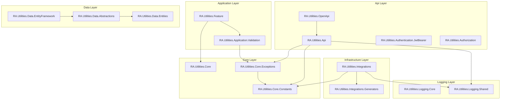

# RA.Utilities

[](https://github.com/RedonAlla/RA.Utilities?tab=MIT-1-ov-file)
[](https://github.com/RedonAlla/RA.Utilities/actions/workflows/publish-nuget.yml)
[](https://codecov.io/gh/RedonAlla/RA.Utilities)
<br />
[](https://www.nuget.org/packages/RA.Utilities.Core/)
[](https://www.nuget.org/packages/RA.Utilities.Core/)

## High-Level Purpose
The main goal is to provide a set of reusable, opinionated building blocks that solve common problems in web API development. By using these packages, you can:

* **Reduce Boilerplate Code**: Automate repetitive tasks like setting up logging, authentication, API documentation, and error handling.
* **Enforce Consistency**: Ensure that all parts of your application follow the same patterns for logging, configuration, and API responses.
* **Promote Clean Architecture**: The packages are designed to guide you toward a **Vertical Slice Architecture** using the **CQRS (Command Query Responsibility Segregation)** pattern. This helps you build features that are self-contained and easier to maintain.
* **Improve Developer Experience**: Simplify complex configurations and provide clear, injectable services for common needs.


## Solution Structure

```
RA.Utilities/
├── 📄 RA.sln
├── 📄 .editorconfig
├── 📄 Directory.Build.props
├── 📄 Directory.Build.targets
├── 📄 Directory.Packages.props
│
├── 📁 Api/
│   ├── 📁 RA.Utilities.Api/
│   ├── 📁 RA.Utilities.Authentication.JwtBearer/
│   ├── 📁 RA.Utilities.Authorization/
│   └── 📁 RA.Utilities.OpenApi/
│
├── 📁 Application/
│   └── 📁 RA.Utilities.Feature/
│
├── 📁 Core/
│   ├── 📁 RA.Utilities.Core/
│   ├── 📁 RA.Utilities.Core.Constants/
│   └── 📁 RA.Utilities.Core.Exceptions/
│
├── 📁 Data/
│   ├── 📁 RA.Utilities.Data.Abstractions/
│   ├── 📁 RA.Utilities.Data.Entities/
│   └── 📁 RA.Utilities.Data.EntityFramework/
│
├── 📁 Infrastructure/
│   └── 📁 RA.Utilities.Integrations/
│
├── 📁 Logging/
│   ├── 📁 RA.Utilities.Logging.Core/
│   └── 📁 RA.Utilities.Logging.Shared/
│
└── 📁 documentation/
```

Here’s how the folders map to architectural layers:

* **`Api/`**: Contains all projects related to the presentation layer (ASP.NET Core). This includes API setup, middleware, authentication, and OpenAPI configuration. This layer depends on `Application` and `Core`.

* **`Application/`**: Holds the core application logic, implementing CQRS and Vertical Slice Architecture. It contains feature-specific handlers and business rules. This layer depends on `Core` but knows nothing about `Api` or `Infrastructure`.

* **`Core/`**: Contains the foundational building blocks of the entire solution. These projects have minimal to zero external dependencies and include shared domain models, exceptions, and constants. All other layers depend on `Core`.

* **`Data/`**: The data access layer, responsible for persistence. It includes abstractions (`RA.Utilities.Data.Abstractions`) and a concrete implementation using Entity Framework (`RA.Utilities.Data.EntityFramework`).

* **`Infrastructure/`**: For projects that interact with out-of-process, external systems. The `RA.Utilities.Integrations` project is a good example, standardizing how you call other APIs.

* **`Logging/`**: Isolates logging as a cross-cutting concern, making it easy to manage and configure across the entire application.

* **`documentation/`**: Treats documentation as a first-class citizen within the solution.

This structure enforces the **Dependency Rule**: source code dependencies can only point inwards. For example, `Api` can depend on `Application`, but `Application` cannot depend on `Api`. This makes the core business logic independent of any specific UI or infrastructure.

## Package Dependency Map

The diagram below shows how every `RA.Utilities` package depends on the others. Arrows point from a package to the packages it depends on — every arrow points inward, toward the `Core` layer.



## How the Pieces Fit Together
The solution is broken down into several NuGet packages, each addressing a specific concern:

| Layer/Concern	| RA.Utilities Package(s)	| Purpose |
| ------------- | ----------------------- | ------- |
| **API & Web** | `RA.Utilities.Api`, `RA.Utilities.Api.Middlewares`, `RA.Utilities.Api.Results`, `RA.Utilities.OpenApi`, `RA.Utilities.Authentication.JwtBearer`, `RA.Utilities.Authorization` |	Provides helpers for standardized API responses (`SuccessResponse`), middleware for logging and header validation, automates OpenAPI/Swagger documentation, and simplifies access to authenticated user data. |
| **Application Logic** | `RA.Utilities.Feature` |	This is the heart of the CQRS implementation. It provides base classes for your feature "handlers" and a validation pipeline to automatically validate incoming requests. |
| **Core Building Blocks** |	`RA.Utilities.Core.Constants`, `RA.Utilities.Core.Exceptions` |	Offers shared constants (like HTTP status codes) and a set of standardized exceptions (`NotFoundException`, `ConflictException`) to create clear, semantic error handling. |
| **Data Access** | `RA.Utilities.Data.Abstractions`, `RA.Utilities.Data.EntityFramework` | Provides abstractions and implementations for talking to the database. |
| **Integrations** | `RA.Utilities.Integrations` | Simplifies and standardizes HTTP client calls to external APIs, with built-in support for configuration, logging, and resilience policies. |
| **Logging** | `RA.Utilities.Logging.Core`, `RA.Utilities.Logging.Shared` | Provides a one-line setup for production-ready structured logging with Serilog. |