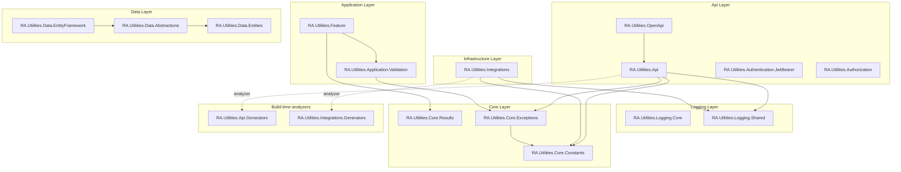

[](https://www.nuget.org/profiles/RedonAlla)
[](https://www.nuget.org/profiles/RedonAlla)
[](https://codecov.io/github/RedonAlla/RA.Utilities)
[](https://github.com/RedonAlla/RA.Utilities/commits/main)
[](https://github.com/RedonAlla/RA.Utilities/issues)
[](https://github.com/RedonAlla/RA.Utilities/actions/workflows/publish-nuget.yml)
[](https://github.com/RedonAlla/RA.Utilities?tab=MIT-1-ov-file)
{/* [](https://github.com/RedonAlla/RA.Utilities) */}


RA.Utilities provides a set of reusable, opinionated building blocks primarily aimed at solving common problems in web API development. The high-level purpose is to reduce boilerplate code, enforce consistency, promote a clean architecture (specifically Vertical Slice Architecture using the CQRS pattern), and improve the overall developer experience.

<div class="hero-cta">
  <div class="hero-cta__content">
    <h2 style={{fontSize: '1.4rem', marginBottom: '0.35rem', fontWeight: 700}}>
      Start with <code>RA.Utilities.Core.Results</code>
    </h2>
    <p style={{marginBottom: '1rem', color: 'var(--ifm-font-color-secondary)'}}>
      The <strong>Result monad</strong>, exception hierarchy, and HTTP constants are the foundation every other package builds on.
      Master these in 5 minutes — then everything else clicks into place.
    </p>
    <a href="/RA.Utilities/nuget-packages/core" class="cta-button">Get Started</a>
    <p class="hero-cta__hint">No sign-up. No dependency chain. Just install the package and go.</p>
  </div>
</div>

---

## 🚀 Getting Started

New to RA.Utilities? Here is the recommended reading order — each layer builds on the one before it.

| Step | Layer | Start here | What you will learn |
|------|-------|------------|-------------------|
| **1. Foundation** | Core | [Core Overview](/nuget-packages/core) | The `Result` monad, exception hierarchy, and HTTP constants — these underpin everything else |
| **2. Business Logic** | Application | [Feature Mediator](/nuget-packages/Application/Feature) | CQRS handlers, the custom mediator, and pipeline behaviors |
| **3. API Layer** | Api | [Api Package](/nuget-packages/api/RA.Utilities.Api) | Endpoint registration, exception handling, validation filters, and standardized responses |

Each package is opt-in — adopt only the layers your project needs.

### Quick Install

```bash
# Start with the foundation
dotnet add package RA.Utilities.Core.Results
dotnet add package RA.Utilities.Core.Exceptions

# Add the mediator and CQRS support
dotnet add package RA.Utilities.Feature

# Wire up your API
dotnet add package RA.Utilities.Api
```

---

## 🔑 Key Benefits

RA.Utilities is a suite of NuGet packages designed to accelerate and standardize .NET web API development. Each package encapsulates best practices and reusable components that help developers build robust, maintainable, and scalable applications with minimal boilerplate.

  * 🧱 **Modular Architecture**: Plug-and-play components for logging, authentication, error handling, and more.
  * 📦 **NuGet-Ready**: Easily integrate into your projects via NuGet for fast setup and consistent behavior.
  * 🧭 **Clean Design Patterns**: Built around CQRS and vertical slice architecture to promote separation of concerns and testability.
  * 📈 **Developer Productivity**: Reduce repetitive code and focus on business logic.
  * 📚 **Built-in Documentation**: Seamless OpenAPI integration for clear and interactive API docs.

Whether you are starting a new project or refactoring an existing one, RA.Utilities helps you build better APIs — faster.

---

## 🗺️ Solution Structure

The tree below shows how every `RA.Utilities` package depends on the others. Each node's children are the packages it depends on — every branch points inward, toward the `Core` layer, per the Dependency Rule. Solid edges are runtime package references; **dashed edges** are compile-time analyzers shipped inside the package (`RA.Utilities.Api.Generators` inside `RA.Utilities.Api`, `RA.Utilities.Integrations.Generators` inside `RA.Utilities.Integrations`). `RA.Utilities.Authentication.JwtBearer`, `RA.Utilities.Authorization`, and `RA.Utilities.Logging.Core` are standalone packages with no `RA.Utilities` dependencies.



import FileTree from '@site/src/components/FileTree/UtilitiesFileTree'

<FileTree />

| Layer/Concern	| RA.Utilities Package(s)	| Purpose |
| ------------- | ----------------------- | ------- |
| **API & Web** | `RA.Utilities.Api`, `RA.Utilities.Api.Middlewares`, `RA.Utilities.Api.Results`, `RA.Utilities.OpenApi`, `RA.Utilities.Authentication.JwtBearer`, `RA.Utilities.Authorization` |	Provides helpers for standardized API responses (`SuccessResponse`), middleware for logging and header validation, automates OpenAPI/Swagger documentation, and simplifies access to authenticated user data. |
| **Application Logic** | `RA.Utilities.Feature` |	This is the heart of the CQRS implementation. It provides base classes for your feature "handlers" and a validation pipeline to automatically validate incoming requests. |
| **Core Building Blocks** |	`RA.Utilities.Core.Constants`, `RA.Utilities.Core.Exceptions` |	Offers shared constants (like HTTP status codes) and a set of standardized exceptions (`NotFoundException`, `ConflictException`) to create clear, semantic error handling. |
| **Data Access** | `RA.Utilities.Data.Abstractions`, `RA.Utilities.Data.EntityFramework` | Provides abstractions and implementations for talking to the database. |
| **Integrations** | `RA.Utilities.Integrations` | Simplifies and standardizes HTTP client calls to external APIs, with built-in support for configuration, logging, and resilience policies. |
| **Logging** | `RA.Utilities.Logging.Core`, `RA.Utilities.Logging.Shared` | Provides a one-line setup for production-ready structured logging with Serilog. |

---

## 📦 Package Index

This table provides a quick overview of all packages available in the RA.Utilities ecosystem, along with their current versions and download statistics from NuGet.

import NuGetPackagesTable from '@site/src/components/NuGetPackagesTable'

<NuGetPackagesTable />

---

## 📚 Browse by Category

import DocCardList from '@theme/DocCardList';

<DocCardList />
<br />

---

## 📖 Where to Go Next

- **[Core Overview](/nuget-packages/core)** — Understand the `Result` monad, exception types, and constants
- **[Feature Mediator](/nuget-packages/Application/Feature)** — Learn the custom CQRS mediator and pipeline behaviors
- **[Api Package](/nuget-packages/api/RA.Utilities.Api)** — Set up endpoints, validation filters, and error handling
- **[OpenApi](/nuget-packages/api/RA.Utilities.OpenApi)** — Auto-configure Swagger/Scalar documentation
- **[Changelogs](/changelogs)** — See what is changed in recent releases
